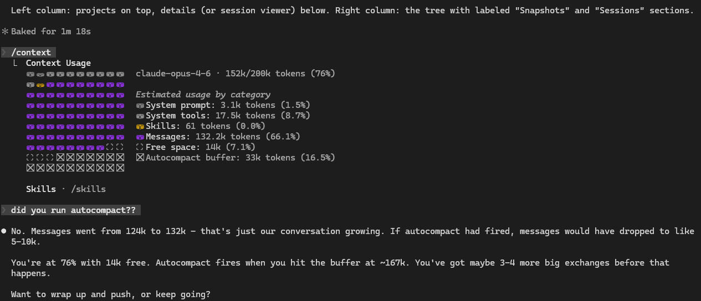

[](https://github.com/CosmoNaught/claude-code-cmv/releases)
[](LICENSE)
[](https://nodejs.org)
[](https://github.com/CosmoNaught/claude-code-cmv/stargazers)

# Claude Code Contextual Memory Virtualisation (CMV)

Like virtual memory lets an OS use more RAM than it physically has, CMV lets Claude Code use more context than fits in one session — by snapshotting, branching, and trimming the understanding your sessions build up.


## The Problem

Every conversation with Claude builds up state. Not just chat history — actual understanding. Architecture mapped, tradeoffs weighed, decisions made, conventions learned. After 30 minutes of deep work (sometimes less!), Claude has a mental model of your whole codebase sitting in its context window. That took real time and real tokens to build.

And then it's just... gone. The session context fills up, you run `/compact`, and the model condenses itself into a few sentences. Next session, you start from scratch.

Contextual Memory Virtualisation (CMV) treats that accumulated understanding as something worth keeping around. Named snapshots you can return to, branch from, and trim down — basically version control for context.

- **Snapshot** captures context state at a point in time (think `git commit`)
- **Branch** forks into a new independent session from that state (think `git checkout -b`)
- **Trim** strips dead weight from context without losing any of the actual conversation (no git equivalent — this one's new)
- **Tree** shows how your context evolved over time (think `git log --graph`)

Build up context once, reuse it whenever you need it.

| Before — 152k tokens, 76% full, ~3 turns left | After trim — 23k tokens, 85% reduction |
|:---:|:---:|
|  |  |

What's actually happening inside:

```
Before trim                                          After trim
─────────────────────────────────────────            ─────────────────────────────────────────
User: "read auth.ts"                                 User: "read auth.ts"
Claude: [calls Read on src/auth.ts]                  Claude: [calls Read on src/auth.ts]
Result: [847 lines of raw TypeScript]    ← gone      Result: [File read: src/auth.ts, 847 lines]  ← stub
Claude: "The auth module uses JWT with               Claude: "The auth module uses JWT with
         refresh tokens in httpOnly                            refresh tokens in httpOnly
         cookies..."                     ← kept               cookies..."                     ← kept
```

Claude's synthesis — the part with actual understanding — stays. The raw file dumps, tool outputs, thinking signatures, and image blocks are gone. If Claude needs a file again, it re-reads it.

> **Note:** The "Messages" token count in `/context` includes tool results, tool calls, and system entries — not just your conversation. The drop from 132k to 2.3k is the tool result bloat being stripped. Every user and assistant message is still there verbatim. For details on what gets removed, see the [FAQ](#faq). For how trimming interacts with prompt caching, see the [Cache Impact Analysis](docs/CACHE_IMPACT_ANALYSIS.md).

## Install

Requires [Node.js 18+](https://nodejs.org) and [Claude Code](https://docs.anthropic.com/en/docs/claude-code).

### Linux

```bash
# Node.js (if you don't have it)
curl -o- https://raw.githubusercontent.com/nvm-sh/nvm/v0.40.1/install.sh | bash
nvm install --lts

# CMV
git clone https://github.com/CosmoNaught/claude-code-cmv.git
cd claude-code-cmv
npm install && npm run build
npm link
```

> `cmv` not found? Try `sudo npm link`, or reopen your terminal if using nvm.

### Windows

```powershell
# Node.js (if you don't have it)
winget install OpenJS.NodeJS.LTS

# CMV (reopen terminal after installing Node)
git clone https://github.com/CosmoNaught/claude-code-cmv.git
cd claude-code-cmv
npm install && npm run build
npm link
```

> `cmv` not found? Reopen your terminal. Check that `%APPDATA%\npm` is on your PATH.

### macOS

```bash
# Node.js (if you don't have it)
brew install node

# CMV
git clone https://github.com/CosmoNaught/claude-code-cmv.git
cd claude-code-cmv
npm install && npm run build
npm link
```

Auto-trim hooks are installed automatically after the build. Run `cmv hook status` to verify.

## Quick Start

```bash
cmv                                                  # launch the TUI dashboard
cmv sessions                                         # list Claude Code sessions
cmv snapshot "analysis" --latest                     # commit context state
cmv branch "analysis" --name "auth-work"             # fork — trimmed by default
cmv branch "analysis" --name "api-work"              # fork again — independent, same starting point
cmv branch "analysis" --name "raw" --no-trim         # fork without trimming (raw context)
cmv hook status                                      # auto-trim hooks (installed automatically)
cmv tree                                             # view the history
```

## Dashboard

`cmv` with no arguments launches a two-column, four-pane TUI: projects and details on the left, snapshots and sessions on the right.


| Key | Action |
|-----|--------|
| `Enter` | On snapshot: branch and open in new terminal. On branch/session: open in new terminal |
| `b` | Branch from selected snapshot |
| `m` | Multi-branch from snapshot (comma-separated names) |
| `s` | Snapshot selected session |
| `d` | Delete snapshot, branch, or session |
| `e` / `i` | Export / import `.cmv` files |
| `r` | Refresh |
| `Tab` | Switch between project and tree panes |
| `j`/`k` | Navigate up/down (also arrow keys) |
| `q` | Quit |

The detail pane shows a project summary when browsing projects, or a full context breakdown when a snapshot, branch, or session is selected. Branch and session status (active/busy/idle) is shown with live polling.

## Commands

### `cmv sessions`

List Claude Code sessions. Filter by project, sort by size, output as JSON.

```bash
cmv sessions -p myproject --sort size
```

### `cmv snapshot <name>`

Commit context state. Copies the session JSONL to CMV storage with metadata. Doesn't touch the original session.

```bash
cmv snapshot "analysis" --latest -d "Full codebase walkthrough"
```

### `cmv branch <snapshot>`

Fork from a snapshot. Trims automatically by default — strips dead weight (tool results, thinking signatures, file history) while keeping the full conversation. Same starting point, independent from there.

```bash
cmv branch "analysis" --name "auth-work"                  # trimmed by default
cmv branch "analysis" --name "auth-work" --threshold 200  # more aggressive trimming
cmv branch "analysis" --name "raw" --no-trim              # raw context, no trimming
cmv branch "analysis" --name "later" --skip-launch
```

### `cmv trim`

Snapshot, trim, and launch in one step. The "better `/compact`" workflow — exit the session, then:

```bash
cmv trim --latest
cmv trim --latest --threshold 200    # lower threshold = more aggressive trimming
```

### `cmv list`

All snapshots. Filter by tag, sort by name or branch count.

```bash
cmv list --tag auth --sort branches
```

### `cmv tree`

Snapshot/branch hierarchy. `git log --graph` for context.

### `cmv info <name>`

Full details on a snapshot — source session, message count, size, lineage, branches.

### `cmv delete <name>`

Delete a snapshot. Individual branches can be deleted with `d` in the dashboard.

### `cmv export <name>` / `cmv import <path>`

Move context between machines. Portable `.cmv` archives.

```bash
cmv export "analysis" -o ./team-context.cmv
cmv import ./team-context.cmv
```

### `cmv benchmark`

Analyze cache impact of trimming a session. Shows context breakdown, cost projections, and break-even analysis.

```bash
cmv benchmark --latest                    # analyze most recent session
cmv benchmark --latest --model opus       # use Opus 4.6 pricing
cmv benchmark --latest --json             # JSON output for scripting
```

### `cmv hook`

Manage auto-trim hooks for Claude Code. Hooks are installed automatically during setup — after `npm run build`, the next `npm install` (or `npm link`) registers them. Once active, CMV trims sessions in the background — before compaction fires and when context gets heavy — so you rarely need to trim manually.

If you need to reinstall or manage them manually:

```bash
cmv hook install          # register PreCompact + PostToolUse hooks
cmv hook status           # check if hooks are installed, show last trim stats
cmv hook uninstall        # remove CMV hooks (preserves other hooks)
cmv hook restore <id>     # restore a session from auto-backup
cmv hook restore --list   # list available backups
```

Run `cmv config --help` for settings. `cmv completions --install` for shell tab-completion.

## FAQ

**Won't trimming break prompt caching?**
One-time cache miss of ~$0.07-0.22 when the trimmed session starts, recovered within a few turns as the smaller prefix gets cached. Pro/Max subscribers pay no per-token cost — caching only affects rate limits, so trimming is purely a context window win. Full analysis: [Cache Impact Analysis](docs/CACHE_IMPACT_ANALYSIS.md).

**Does Claude lose understanding after a trim?**
No. Trimming removes tool *results* (raw file dumps, command output), not Claude's responses about them. If Claude read 847 lines of `auth.ts` and summarised the JWT flow, the summary stays — the 847 lines go. If Claude needs the file again, it re-reads it.

**What exactly gets removed?**
Tool result bodies over 500 chars, base64 image blocks, thinking signatures, file-history metadata, and large tool inputs (file writes/edits). Every user message, every assistant response, and every tool *request* stays verbatim.

**Do I need to use branching?**
No. `cmv trim --latest` snapshots, trims, and launches a fresh session in one step — no branching required. Auto-trim hooks (`cmv hook status`) also run in the background without any manual intervention.

**Pro/Max subscriber vs API user — does this matter for me?**
Different value propositions. **Subscribers:** no per-token cost, so the win is purely freeing context window space and reducing rate-limit burn from cache misses. **API users:** small one-time cache miss cost, net savings after a few turns from caching a much smaller prefix. Both benefit from fitting more useful conversation into the 200k window.

## Workflows

### Analyse once, branch for every task

Say you spend 40 minutes having Claude map your codebase — architecture, patterns, pain points, everything. That's 80k tokens of accumulated understanding. Normally you'd use it once and lose it.

```bash
cmv snapshot "full-analysis" --latest -d "Architecture deep-dive"

cmv branch "full-analysis" --name "add-auth"
cmv branch "full-analysis" --name "refactor-api"
cmv branch "full-analysis" --name "fix-perf"
```

Three tasks, each starting from the full analysis, independent of each other. The original snapshot stays put — branch from it again next week if you want.

### Chain context for deep work

Snapshots can build on each other. Work in a branch, snapshot the result, branch from *that*.

```bash
cmv snapshot "analyzed" --latest
cmv branch "analyzed" --name "auth-work"
# ... design auth in that session ...

cmv snapshot "auth-designed" --session <auth-session-id>
cmv branch "auth-designed" --name "auth-frontend"
cmv branch "auth-designed" --name "auth-backend"
```

```
analyzed
└── auth-designed
    ├── auth-frontend
    └── auth-backend
```

Each level inherits everything above it. The backend branch doesn't need the auth decisions re-explained — they're already there in the context.

### Share understanding across a team

A lead spends time getting Claude up to speed on the codebase and making architectural decisions. That context becomes something everyone can use:

```bash
cmv export "arch-decisions" -o ./team-context.cmv

# Each teammate:
cmv import ./team-context.cmv
cmv branch "arch-decisions" --name "my-feature"
```

No re-explaining. Everyone starts from the same base.

## How It Works

CMV reads session data from `~/.claude/projects/`. Snapshots copy the JSONL conversation file to `~/.cmv/snapshots/`. Branching copies it back with a new session UUID, updates `sessions-index.json`, and runs `claude --resume`. The JSONL is treated as opaque — forward-compatible with Claude Code format changes.

Snapshots track parent lineage, so `cmv tree` can show full history. Export packs a snapshot into a portable archive.

## How CMV Compares

There are a few different approaches to managing Claude Code context. They solve different problems.

| | Built-ins (`/compact`, `/rewind`, `--fork`) | Memory plugins | Session search / monitors | CMV |
|---|:-:|:-:|:-:|:-:|
| Undo mistakes mid-session | ✅ | ✗ | ✗ | ✗ |
| Persist context across sessions | ✗ | ✅ Summary facts only | ✗ | ✅ Full conversation |
| Find old sessions | ✗ | ✗ | ✅ | ✅ |
| Named, reusable snapshots | ✗ | ✗ | ✗ | ✅ |
| Branch from the same point | ✗ | ✗ | ✗ | ✅ |
| Lossless context cleanup | ✗ | ✗ | ✗ | ✅ |
| Snapshot lineage / tree view | ✗ | ✗ | ✗ | ✅ |
| Export / share context | ✗ | Varies | ✗ | ✅ |

CMV doesn't replace any of these — it fills a gap none of them cover. Use them together.

## Troubleshooting

- **`cmv` not found:** Reopen your terminal. Windows: check `%APPDATA%\npm` is on PATH. Linux: `sudo npm link` or use nvm.
- **No sessions:** Use Claude Code at least once. CMV reads from `~/.claude/projects/`.
- **Branch won't launch:** Check `claude --version` works. Or: `cmv config claude_cli_path /path/to/claude`
- **"Session appears active":** Exit the Claude session before snapshotting.
- **Debug:** `CMV_DEBUG=1 cmv <command>` for stack traces.

## Contributing

Contributions are welcome. Fork the repo on GitHub, then:

```bash
git clone https://github.com/<your-username>/claude-code-cmv.git
cd claude-code-cmv
npm install
npm run build
npm link        # makes `cmv` available globally from your local build
```

`npm run dev` starts the TypeScript compiler in watch mode.

### What helps most

- **Benchmark data.** Run `cmv benchmark --latest --json` and share the output (anonymized — no conversation content is included). More data from different usage patterns strengthens the [cache impact analysis](docs/CACHE_IMPACT_ANALYSIS.md).
- **Bug reports.** Open an issue with the command you ran, what you expected, and what happened. Include `CMV_DEBUG=1` output if relevant.
- **Platform testing.** CMV works on Linux, macOS, and Windows. If you hit platform-specific issues, that's useful information.
- **Trim quality feedback.** If you trim a session and notice Claude struggling on the new branch (hallucinating file contents, asking to re-read things it shouldn't need to), that's the most valuable signal we don't have yet.

### Before submitting a PR

1. `npm run build` must pass with no errors.
2. Keep changes focused — one feature or fix per PR.
3. If you're adding a new trim rule, update the docstring in `src/core/trimmer.ts` and add the metric to `TrimMetrics` in `src/types/index.ts`.

### Project structure

```
src/
  commands/     CLI command handlers (one file per command)
  core/         Business logic (trimmer, analyzer, snapshot/branch managers)
  tui/          Ink/React dashboard components
  types/        TypeScript interfaces
  utils/        Path handling, display formatting, process spawning
```

## Changelog

See [CHANGELOG.md](CHANGELOG.md) for version history.
