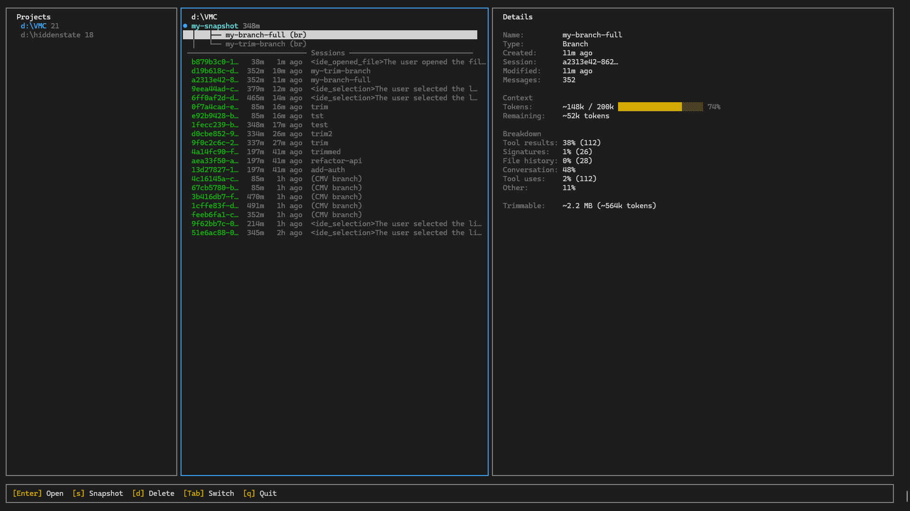

# Claude Code Contextual Memory Virtualisation (CMV)

Like virtual memory lets an OS use more RAM than it physically has, CMV lets Claude Code use more context than fits in one session — by snapshotting, branching, and trimming the understanding your sessions build up.


## The Problem

Every conversation with Claude builds up state. Not just chat history — actual understanding. Architecture mapped, tradeoffs weighed, decisions made, conventions learned. After 30 minutes of deep work (sometimes less!), Claude has a mental model of your whole codebase sitting in its context window. That took real time and real tokens to build.

And then it's just... gone. The session context fills up, you run `/compact`, and the model condenses itself into a few sentences. Next session, you start from scratch.

Contextual Memory Virtualisation (CMV) treats that accumulated understanding as something worth keeping around. Named snapshots you can return to, branch from, and trim down — basically version control for context.

- **Snapshot** captures context state at a point in time (think `git commit`)
- **Branch** forks into a new independent session from that state (think `git checkout -b`)
- **Trim** strips dead weight from context without losing any of the actual conversation (no git equivalent — this one's new)
- **Tree** shows how your context evolved over time (think `git log --graph`)

Build up context once, reuse it whenever you need it.
## Quick Start

```bash
cmv                                                  # launch the TUI dashboard
cmv sessions                                         # list Claude Code sessions
cmv snapshot "analysis" --latest                     # commit context state
cmv branch "analysis" --name "auth-work"             # fork — full history, fresh session
cmv branch "analysis" --name "api-work"              # fork again — independent, same starting point
cmv branch "analysis" --name "trimmed" --trim        # fork with cleanup — strips bloat, keeps conversation
cmv tree                                             # view the history
```

```
analysis (snapshot, 2d ago, 82 msgs)
├── auth-work (branch, 2d ago)
├── api-work (branch, 1d ago)
└── trimmed (branch, 1d ago)
```

## Install

Requires [Node.js 18+](https://nodejs.org) and [Claude Code](https://docs.anthropic.com/en/docs/claude-code).

### Linux

```bash
# Node.js (if you don't have it)
curl -o- https://raw.githubusercontent.com/nvm-sh/nvm/v0.40.1/install.sh | bash
nvm install --lts

# CMV
git clone https://github.com/CosmoNaught/claude-code-cmv.git
cd cmv
npm install && npm run build
npm link
```

> `cmv` not found? Try `sudo npm link`, or reopen your terminal if using nvm.

### Windows

```powershell
# Node.js (if you don't have it)
winget install OpenJS.NodeJS.LTS

# CMV (reopen terminal after installing Node)
git clone https://github.com/CosmoNaught/claude-code-cmv.git
cd cmv
npm install && npm run build
npm link
```

> `cmv` not found? Reopen your terminal. Check that `%APPDATA%\npm` is on your PATH.

### macOS (untested as of 19/02/2025)

```bash
# Node.js (if you don't have it)
brew install node

# CMV
git clone https://github.com/CosmoNaught/claude-code-cmv.git
cd cmv
npm install && npm run build
npm link
```

## Dashboard

`cmv` with no arguments launches a three-column Ranger-style TUI.



| Key | Action |
|-----|--------|
| `b` | Branch from selected snapshot |
| `t` | Trim branch — strips bloat, keeps conversation |
| `s` | Snapshot selected session |
| `d` | Delete snapshot or branch |
| `e` / `i` | Export / import `.cmv` files |
| `Enter` | Branch and launch Claude |

Arrow keys or `j`/`k` to navigate. `Tab` switches panes. The detail pane shows a full context breakdown — what's eating your tokens and how much you can trim.

## Commands

### `cmv sessions`

List Claude Code sessions. Filter by project, sort by size, output as JSON.

```bash
cmv sessions -p myproject --sort size
```

### `cmv snapshot <name>`

Commit context state. Copies the session JSONL to CMV storage with metadata. Doesn't touch the original session.

```bash
cmv snapshot "analysis" --latest -d "Full codebase walkthrough"
```

### `cmv branch <snapshot>`

Fork from a snapshot. Creates a new session with the full conversation history. Same starting point, independent from there.

```bash
cmv branch "analysis" --name "auth-work"
cmv branch "analysis" --name "clean-start" --trim
cmv branch "analysis" --name "clean-start" --trim --threshold 200  # more aggressive
cmv branch "analysis" --name "later" --skip-launch
```

### `cmv trim`

Snapshot, trim, and launch in one step. The "better `/compact`" workflow — exit the session, then:

```bash
cmv trim --latest
cmv trim --latest --threshold 200    # lower threshold = more aggressive trimming
```

More on this [below](#trim).

### `cmv list`

All snapshots. Filter by tag, sort by name or branch count.

```bash
cmv list --tag auth --sort branches
```

### `cmv tree`

Snapshot/branch hierarchy. `git log --graph` for context.

### `cmv info <name>`

Full details on a snapshot — source session, message count, size, lineage, branches.

### `cmv delete <name>`

Delete a snapshot. Individual branches can be deleted with `d` in the dashboard.

### `cmv export <name>` / `cmv import <path>`

Move context between machines. Portable `.cmv` archives.

```bash
cmv export "analysis" -o ./team-context.cmv
cmv import ./team-context.cmv
```

### `cmv benchmark`

Analyze cache impact of trimming a session. Shows context breakdown, cost projections, and break-even analysis.

```bash
cmv benchmark --latest                    # analyze most recent session
cmv benchmark --latest --model opus       # use Opus 4.6 pricing
cmv benchmark --latest --json             # JSON output for scripting
```

Run `cmv config --help` for settings. `cmv completions --install` for shell tab-completion.

## Trim

This is the bit that actually matters. A typical 150k-token session looks roughly like this:

| Content | % of context | Value on reload |
|---------|-------------|-----------------|
| Tool results (file contents, bash output) | ~60-70% | None — Claude already synthesised these |
| Thinking signatures (base64 blobs) | ~15-20% | None — cryptographic verification, not reasoning |
| Your actual conversation | ~10-15% | All of it |

Most of your context window is stuff Claude doesn't need anymore.

`/compact` deals with this by nuking everything and writing a summary. Trim does the opposite: throw away the junk, keep the conversation.

Before trim:
```
User: "read auth.ts"
Claude: [calls Read on src/auth.ts]
Result: [847 lines of raw TypeScript]                    ← gone
Claude: "The auth module uses JWT with refresh tokens
         stored in httpOnly cookies..."                   ← kept
```

After trim:
```
User: "read auth.ts"
Claude: [calls Read on src/auth.ts]
Result: [File read: src/auth.ts, 847 lines]              ← stub
Claude: "The auth module uses JWT with refresh tokens
         stored in httpOnly cookies..."                   ← kept
```

Claude's synthesis — the part with the actual understanding — stays. The 847 lines of raw source are gone. If Claude needs the file again later, it can just re-read it.

**What gets removed:** tool result bodies over 500 chars, image blocks (base64 screenshots), large tool_use inputs (Write/Edit file contents), thinking signatures, file-history metadata, queue operations, and pre-compaction dead lines.

**What stays:** every user message, every assistant response, every tool use request, all reasoning.

Typical reduction is 50-70%+, with near-zero information loss. Use `--threshold 200` for more aggressive trimming. Compare that to `/compact`, which gets you ~98% reduction but wipes out the entire conversation in the process.

For a detailed analysis of how trimming interacts with Anthropic's prompt caching and what it costs, see the [Cache Impact Analysis](docs/CACHE_IMPACT_ANALYSIS.md).

## Workflows

### Analyse once, branch for every task

Say you spend 40 minutes having Claude map your codebase — architecture, patterns, pain points, everything. That's 80k tokens of accumulated understanding. Normally you'd use it once and lose it.

```bash
cmv snapshot "full-analysis" --latest -d "Architecture deep-dive"

cmv branch "full-analysis" --name "add-auth"
cmv branch "full-analysis" --name "refactor-api"
cmv branch "full-analysis" --name "fix-perf"
```

Three tasks, each starting from the full analysis, independent of each other. The original snapshot stays put — branch from it again next week if you want.

### Chain context for deep work

Snapshots can build on each other. Work in a branch, snapshot the result, branch from *that*.

```bash
cmv snapshot "analyzed" --latest
cmv branch "analyzed" --name "auth-work"
# ... design auth in that session ...

cmv snapshot "auth-designed" --session <auth-session-id>
cmv branch "auth-designed" --name "auth-frontend"
cmv branch "auth-designed" --name "auth-backend"
```

```
analyzed
└── auth-designed
    ├── auth-frontend
    └── auth-backend
```

Each level inherits everything above it. The backend branch doesn't need the auth decisions re-explained — they're already there in the context.

### Stay ahead of context bloat

Don't wait for auto-compact to kick in. When a session gets heavy, just exit and trim:

```bash
cmv trim --latest
```

Fresh session, full conversation, 50-70% less dead weight. Repeat whenever things get chunky.

### Share understanding across a team

A lead spends time getting Claude up to speed on the codebase and making architectural decisions. That context becomes something everyone can use:

```bash
cmv export "arch-decisions" -o ./team-context.cmv

# Each teammate:
cmv import ./team-context.cmv
cmv branch "arch-decisions" --name "my-feature"
```

No re-explaining. Everyone starts from the same base.

## How It Works

CMV reads session data from `~/.claude/projects/`. Snapshots copy the JSONL conversation file to `~/.cmv/snapshots/`. Branching copies it back with a new session UUID, updates `sessions-index.json`, and runs `claude --resume`. The JSONL is treated as opaque — forward-compatible with Claude Code format changes.

Snapshots track parent lineage, so `cmv tree` can show full history. Export packs a snapshot into a portable archive.

## How CMV Compares

There are a few different approaches to managing Claude Code context. They solve different problems.

| | Built-ins (`/compact`, `/rewind`, `--fork`) | Memory plugins | Session search / monitors | CMV |
|---|:-:|:-:|:-:|:-:|
| Undo mistakes mid-session | ✅ | ✗ | ✗ | ✗ |
| Persist context across sessions | ✗ | ✅ Summary facts only | ✗ | ✅ Full conversation |
| Find old sessions | ✗ | ✗ | ✅ | ✅ |
| Named, reusable snapshots | ✗ | ✗ | ✗ | ✅ |
| Branch from the same point | ✗ | ✗ | ✗ | ✅ |
| Lossless context cleanup | ✗ | ✗ | ✗ | ✅ |
| Snapshot lineage / tree view | ✗ | ✗ | ✗ | ✅ |
| Export / share context | ✗ | Varies | ✗ | ✅ |

CMV doesn't replace any of these — it fills a gap none of them cover. Use them together!

## Why Not Just Use `/rewind`, `/fork`, or `/compact`?

Claude Code already has session-level primitives. CMV isn't replacing them — it's the layer on top that they're missing.

**`/rewind`** is an undo button. It rolls back file edits and conversation within the current session. Good for "Claude just broke my auth module, go back three turns." But it doesn't name states, doesn't persist anything, doesn't trim bloat, and doesn't let you branch from the same point twice. It's a safety net, not a management system.

**`/fork`** creates a one-off copy of your conversation. Useful, but it's not version control. You can't name the fork point, come back to it later, branch five more times from it, see the tree, or trim before forking. After a few days you end up with a flat list of session IDs and no idea which came from where.

**`/compact`** just destroys state. It replaces your entire conversation with a 3-4k token summary the model writes about itself. That 15-turn discussion where you debated JWT vs sessions and explored a bunch of tradeoffs? Now it's: *"We discussed auth and decided on JWT."* Cool, thanks.

**CMV sits above all three.** Use rewind during a session. When the session's done, snapshot and branch with CMV. Use trim instead of compact when things get bloated — it strips 50-70% of dead weight while keeping every message verbatim. They all work together.

## Troubleshooting

- **`cmv` not found:** Reopen your terminal. Windows: check `%APPDATA%\npm` is on PATH. Linux: `sudo npm link` or use nvm.
- **No sessions:** Use Claude Code at least once. CMV reads from `~/.claude/projects/`.
- **Branch won't launch:** Check `claude --version` works. Or: `cmv config claude_cli_path /path/to/claude`
- **"Session appears active":** Exit the Claude session before snapshotting.
- **Debug:** `CMV_DEBUG=1 cmv <command>` for stack traces.

## Contributing

Contributions are welcome. Here's how to get set up:

```bash
git clone https://github.com/CosmoNaught/claude-code-cmv.git
cd cmv
npm install
npm run build
npm link        # makes `cmv` available globally from your local build
```

`npm run dev` starts the TypeScript compiler in watch mode.

### What helps most

- **Benchmark data.** Run `cmv benchmark --latest --json` and share the output (anonymized — no conversation content is included). More data from different usage patterns strengthens the [cache impact analysis](docs/CACHE_IMPACT_ANALYSIS.md).
- **Bug reports.** Open an issue with the command you ran, what you expected, and what happened. Include `CMV_DEBUG=1` output if relevant.
- **Platform testing.** macOS support is untested. If you're on macOS and it works (or doesn't), that's useful information.
- **Trim quality feedback.** If you trim a session and notice Claude struggling on the new branch (hallucinating file contents, asking to re-read things it shouldn't need to), that's the most valuable signal we don't have yet.

### Before submitting a PR

1. `npm run build` must pass with no errors.
2. Keep changes focused — one feature or fix per PR.
3. If you're adding a new trim rule, update the docstring in `src/core/trimmer.ts` and add the metric to `TrimMetrics` in `src/types/index.ts`.

### Project structure

```
src/
  commands/     CLI command handlers (one file per command)
  core/         Business logic (trimmer, analyzer, snapshot/branch managers)
  tui/          Ink/React dashboard components
  types/        TypeScript interfaces
  utils/        Path handling, display formatting, process spawning
```

## Changelog

See [CHANGELOG.md](CHANGELOG.md) for version history.