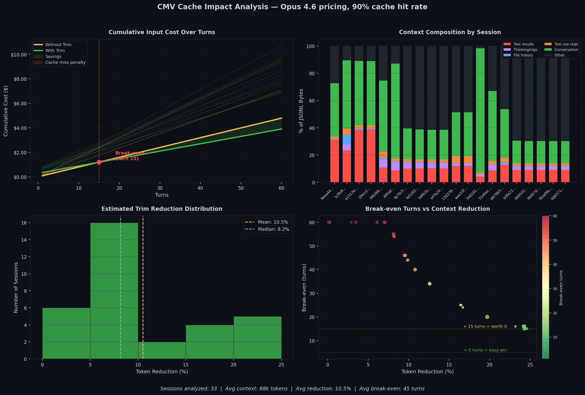

# CMV Cache Impact Analysis

## Context

CMV's `trim` feature reduces context window usage by stripping mechanical overhead (tool results, image blocks, tool_use inputs, thinking block signatures, file-history snapshots, queue operations, and pre-compaction dead lines) from Claude Code session data. A natural question arose during community discussion: **does trimming invalidate prompt caching in a way that increases costs?**

This document presents empirical data from 33 real Claude Code sessions to answer that question. It also identifies what this analysis covers and what remains open for future work.

---

## TL;DR

- **Most Claude Code users pay a flat subscription** (Pro $20/mo, Max $100-200/mo). For them, per-token costs don't apply — **trimming is purely a context window optimization with no cost implications.**
- **For API-key users**, trimming causes a one-time cache miss costing $0.07-0.22 for typical sessions (up to $0.56 for sessions near the 200k context limit). This is recovered within 3-45 turns of continued conversation. **Over any non-trivial session, trimming is cost-neutral to cost-positive.**
- **Trimming in CMV is only available during snapshotting**, which creates a new branch for a different task. **This reduces the likelihood that stripped tool results would have been needed downstream.**
- **Open question**: whether stripping tool results affects response quality on the new branch. **This analysis covers cost only.** Quality impact measurement is planned. However, from qualitative results the author has yet to note meaningful degradation across snapshot trimmed tasks.
  
---

## Background

Claude Code sends the full conversation history as input tokens on every API call. Over a long session, this context accumulates mechanical overhead:

- **Tool results** — full file contents, grep output, command results (often 5-50k chars each)
- **Image blocks** — base64-encoded screenshots and diagrams inside tool results (50-200KB each)
- **Tool_use inputs** — Write/Edit tool calls contain the full file being written (often 5-20k chars)
- **Thinking block signatures** — cryptographic signatures on every thinking block
- **File-history snapshots** — periodic dumps of working directory state
- **Queue operations** — internal scheduling metadata
- **Pre-compaction dead lines** — JSONL lines before the last compaction boundary, no longer in active context

CMV's `trim` feature removes this overhead when creating a snapshot/branch, reducing the token count sent to the API. Because Anthropic uses [prompt caching](https://docs.anthropic.com/en/docs/build-with-claude/prompt-caching), trimming changes the prompt prefix and causes a cache miss on the first subsequent turn. Since cache writes cost 1.25x base price while cache reads cost 0.1x, this miss introduces a one-time cost penalty.

The question is whether subsequent per-turn savings (from caching a smaller prefix) recover that penalty.

---

## Methodology

### Data Collection
- Scanned all Claude Code sessions from `~/.claude/projects/`
- Excluded subagent sessions (internal Claude processes)
- Filtered out sessions with <10 messages or <5,000 tokens
- **33 sessions** qualified for analysis
- All sessions are from a single user (the author). Multi-user data would strengthen these findings — see [Reproduce These Results](#reproduce-these-results) for how to contribute.

### Token Estimation
- Preferred API-reported `usage.input_tokens` from JSONL when available
- Fell back to `content_chars / 4 + 20,000` (system overhead) heuristic
- Respected compaction boundaries (Claude Code's built-in summarization)

### Trim Simulation
Mirrors the actual trim rules in `trimmer.ts` (v1.1.0):
1. Pre-compaction content → skipped entirely (everything before the last compaction boundary)
2. `file-history-snapshot` entries → removed entirely
3. `queue-operation` entries → removed entirely
4. Image blocks (`type: 'image'`) in tool results → always stripped
5. `tool_result` blocks > threshold (default 500 chars) → stubbed to ~35 bytes each
6. `tool_use` input for Write/Edit/NotebookEdit → large content fields stubbed; broad fallback stubs any tool with oversized inputs
7. Thinking blocks → removed entirely (API requires cryptographic signature)
8. API usage metadata → stripped
9. Everything else → preserved

The benchmark estimator accounts for rules 1-3 and 5 directly. For rule 6, it estimates ~30% of tool_use request bytes are stubbable (conservative — Write/Edit-heavy sessions are higher). Image stripping (rule 4) and pre-compaction skipping (rule 1) are not yet modeled in the estimator, meaning the benchmark still understates actual reductions for sessions with screenshots or compaction history.

### Cost Model

**These per-token costs only apply to API-key users.** Claude Code Pro/Max subscribers pay a flat monthly fee regardless of token usage.

Using [official Anthropic pricing](https://docs.anthropic.com/en/docs/build-with-claude/prompt-caching) (as of February 2026):

| Model | Base Input | Cache Write (1.25x) | Cache Read (0.1x) |
|-------|-----------|--------------------|--------------------|
| Opus 4.6 | $5.00/MTok | $6.25/MTok | $0.50/MTok |
| Opus 4/4.1 | $15.00/MTok | $18.75/MTok | $1.50/MTok |
| Haiku 4.5 | $1.00/MTok | $1.25/MTok | $0.10/MTok |

Analysis below uses **Opus 4.6 pricing** as the current default Claude Code model.

### Cache Hit Rate Assumption

We assume a **90% cache hit rate** in steady state. This is not empirically measured — it is an estimate based on the observation that conversation history is append-only between turns, so most of the prompt prefix remains unchanged. Note that system prompts, tool definitions, and other prefix content can change between turns (e.g. when Claude Code updates its tool list), which would reduce the effective hit rate. The 90% figure is a modelling assumption, not a claim about actual cache behavior.

**Sensitivity**: if the real cache hit rate is lower (e.g. 70%), the absolute cost of a cache miss from trimming is smaller (because baseline costs are already higher from organic misses), and the break-even period shifts only modestly. The directional finding — that trimming recovers its cost over a non-trivial session — holds across reasonable cache hit assumptions (60-95%). The specific break-even numbers (44, 60, 3 turns) should be read as indicative rather than precise — the claim is directional, not exact.

---

## Results

> **Note:** The benchmark data below was collected with the v1.0 trimmer (3 rules: file-history removal, thinking block removal, tool result stubbing). The v1.1.0 trimmer adds image stripping, tool_use input stubbing, pre-compaction skipping, and queue-operation removal. Actual reductions with v1.1.0 are larger than these numbers. Run `cmv benchmark --latest` for current estimates.

### Context Reduction (v1.0 baseline)

| Metric | Value |
|--------|-------|
| Sessions analyzed | 33 |
| Mean token reduction | 10.5% |
| Median token reduction | 8.2% |
| Sessions with >30% reduction | 0/33 |
| Max reduction observed | 24.7% |
| Mean pre-trim tokens | ~45k |

Most sessions cluster around 5-10% reduction. Higher reductions (20-25%) appear in sessions that have not yet been compacted by Claude Code's built-in summarizer. Post-compaction sessions, which represent the majority in a normal workflow, show more modest reduction. Note that these are the benchmark's conservative estimates — see [Benchmark vs. Observed Reduction](#benchmark-vs-observed-reduction) for why real-world reductions are significantly higher.

### Cache Cost Impact (Opus 4.6, API-key users only, v1.0 baseline)

| Metric | Value |
|--------|-------|
| Mean cache miss penalty | $0.07-0.22 |
| Mean savings per turn | $0.003-0.02 |
| Mean break-even | ~45 turns |
| Worst-case break-even | ~60 turns |
| Best-case break-even | 3 turns |

### Interpretation

**Turn 1 after trim**: All tokens are written fresh at 1.25x base price instead of served from cache at 0.1x. This is the one-time penalty.

**Turn 2+ after trim**: The new (smaller) prefix is cached. Each subsequent turn costs less than it would have without trimming, because cache reads are applied to fewer tokens.

**Break-even**: For sessions with ~10% reduction, this takes approximately 44 turns. For sessions with 30%+ reduction, break-even occurs within 3-5 turns. Even before break-even, the cumulative cost difference is small — on the order of cents.

For sessions with minimal reduction (<5%), trimming offers negligible cost benefit. The `cmv benchmark` command flags these directly.

### Benchmark vs. Observed Reduction (v1.0)

The benchmark model is deliberately conservative. When we compared its predictions against actual Claude Code `/context` output for the same session before and after trimming (using the v1.0 trimmer), the real reduction was roughly **2x larger** than predicted:

| Metric | Benchmark Prediction | Observed (`/context`) |
|--------|---------------------|----------------------|
| Pre-trim tokens | 148,494 | 147k |
| Post-trim tokens | 112,388 | 74k |
| Reduction | 24.3% | ~50% |
| Free space reclaimed | — | 27k → 93k |

**Before trim** (session a2313e42 — 147k/200k, 13.5% free):


**After trim** (session d19b618c — 74k/200k, 46.4% free):


Three factors explained the gap (at time of v1.0 measurement):

1. **Image content inflated the byte denominator.** The benchmark estimated trim savings as a ratio of removed bytes to total bytes. Sessions containing image tool results (base64 screenshots, diagrams) had large byte counts that contributed minimally to token count (~0.008 tokens/byte vs ~0.25 for text). In v1.0, images were never trimmed, inflating `total_bytes` and making the byte-ratio a poor proxy for the token-ratio. **As of v1.1.0, image blocks are always stripped from tool results**, which both improves the actual reduction and should narrow this gap in future benchmarks.

2. **Bytes and tokens are not proportional for mixed content.** The model applies a single byte-removal ratio to the token estimate. This works when content is uniformly text, but breaks down when the session contains a mix of base64 images (high bytes, low tokens) and conversation text (low bytes, high tokens). Removing 100k chars of tool result text has far more token impact than the byte ratio suggests.

3. **Thinking block field name mismatch (fixed in v1.0.1).** The analyzer was reading `block.text` for thinking blocks, but Claude's API stores thinking content under `block.thinking`. This has been fixed.

**Why we keep the conservative model:** A benchmark that understates its case is harder to attack than one that overstates it. The model's directional finding — that trimming recovers its cache miss cost over a non-trivial session — holds regardless, and is strengthened by the observation that real reductions are larger than modeled.

---

## Charts

### Opus 4.6 Pricing


### Reading the Charts

**Top-left — Cumulative Cost**: Total input cost over 60 turns. Yellow = no trim, green = with trim. The red dot marks the break-even point. Thin background lines show individual sessions; the thick line highlights the session with the highest bloat.

**Top-right — Context Composition**: Stacked bars showing content breakdown per session. Red (tool results) and magenta (thinking signatures) represent trimmable overhead. Green (conversation) is preserved.

**Bottom-left — Reduction Distribution**: Histogram of token reduction per session. The distribution is left-skewed — most sessions see modest reduction, with a long right tail of high-bloat sessions.

**Bottom-right — Break-even vs Reduction**: Each bubble is a session. X-axis = reduction percentage, Y-axis = turns to break-even. Most sessions cluster in the upper-left (modest reduction, longer break-even). Sessions in the lower-right represent the strongest cost-saving candidates.

---

## What This Analysis Does Not Cover

### Response Quality

Trimming removes tool result content that Claude may reference in subsequent turns. If a stripped file listing or command output is needed for downstream reasoning, Claude may hallucinate, ask for a re-read, or produce lower-quality responses.

The mitigating factor: **trimming in CMV only occurs during snapshotting, which creates a new branch.** The intended workflow is to complete a line of work, snapshot, trim, and branch to a different task. The new branch retains the full conversational context (decisions made, approaches discussed) without the raw data dumps. For divergent tasks, this is likely sufficient — but "likely" is not "measured."

The planned approach to close this gap:

- Take snapshots at various conversation depths
- Branch twice from each: one trimmed, one untrimmed
- Give both branches the same follow-up task
- Compare output quality (correctness, hallucination rate, need for file re-reads)
- Identify which categories of tool results carry downstream signal vs. which are safe to strip

Until that work is complete, the quality impact of trimming is an open question.

### Multi-User Variance

All 33 sessions are from a single user and machine. Different coding patterns, project types, tool usage, and session lengths will produce different bloat profiles. We encourage users to run `cmv benchmark --latest --json` and share anonymized results to build a broader dataset.

---

## When Trimming Is Not Recommended

- **Sessions with <5% reduction**: Minimal overhead to remove
- **Sessions that won't be continued**: No subsequent turns to recover the cache miss cost
- **Very short continuations (<20 turns expected)**: May not reach break-even for modestly bloated sessions
- **Branches that continue the same file-editing task**: If the new branch needs specific tool outputs from the previous context, don't trim

---

## Summary

For subscription users, trimming has no cost implications and serves purely as a context window optimization. For API-key users, trimming introduces a small one-time cache miss penalty that is recovered over continued use of the session. The net cost impact is neutral to positive for any session of non-trivial length.

The primary value of trimming is not cost savings but context window management: reclaiming space within the 200k token limit, delaying lossy auto-compaction, and enabling branching workflows. The effect of trimming on downstream response quality has not yet been measured and is the most important open question for future work.

---

## Reproduce These Results

```bash
# Install CMV
npm install -g cmv

# Run benchmark on your most recent session (defaults to Opus 4.6 pricing)
cmv benchmark --latest

# JSON output for programmatic analysis
cmv benchmark --latest --json

# Full statistical analysis with charts
pip install matplotlib numpy
python docs/assets/benchmark_analysis.py --model opus --output cmv_benchmark_opus
```

---

## Source

- Pricing data: [Anthropic Prompt Caching Documentation](https://docs.anthropic.com/en/docs/build-with-claude/prompt-caching)
- Analysis code: [`docs/assets/benchmark_analysis.py`](assets/benchmark_analysis.py)
- CMV: [github.com/CosmoNaught/cmv](https://github.com/CosmoNaught/claude-code-cmv)

*Originally generated February 2026 (v1.0 baseline). Trim rules updated for v1.1.0. All analysis run against real Claude Code sessions on the author's machine.*